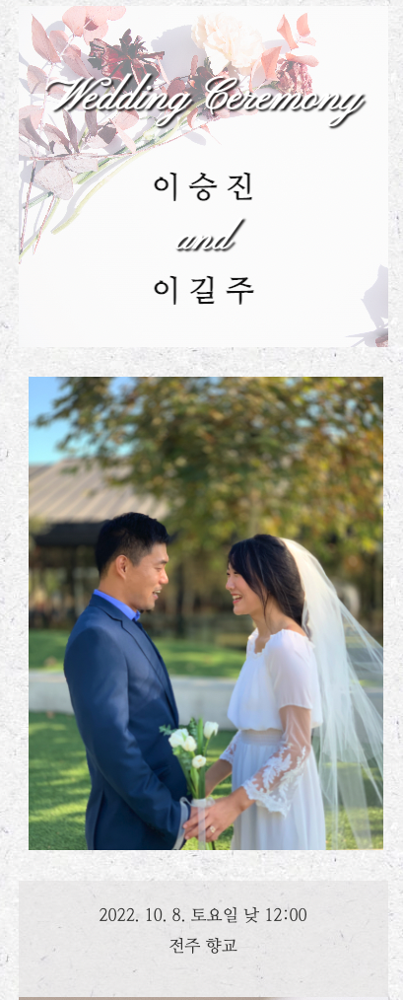

# my-wedding-invitation

## Description

My personal wedding invitation as a single-page application built with React.js. This web application designed for the mobile-friendly is composed of a video message that the video was edited by iMovie and uploaded to Youtube for the high quality and file-size limitation in GitHub, a gallery used by external library, react-responsive-carousel, contact, and a map via the API of NAVER.

## Built with

- JavaScript
- Node.js
- React.js
- react-responsive-carousel
- NAVER map API
- gh-pages

## Deployed application

https://infinissible.github.io/my-wedding-invitation/

## Installation

`npm init`

`npx create-react-app`

## Usage

`npm start`

## Screenshot

## Questions

Find me on GitHub
infinissible
repo: https://github.com/infinissible

Email me with any questions
infinissible@gmail.com
